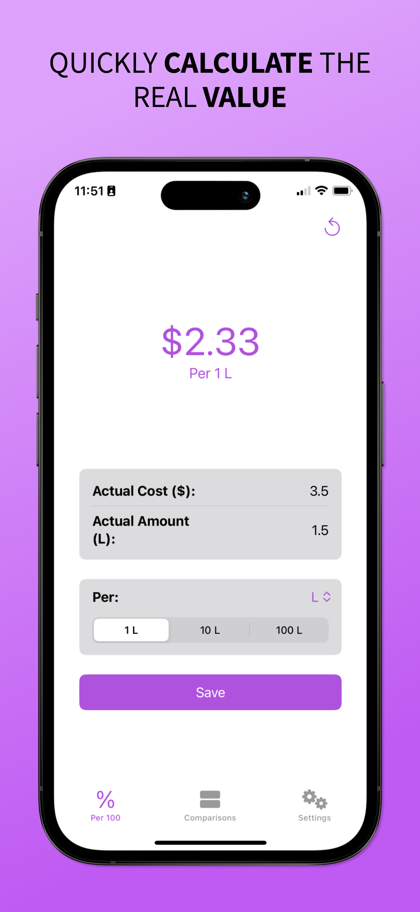
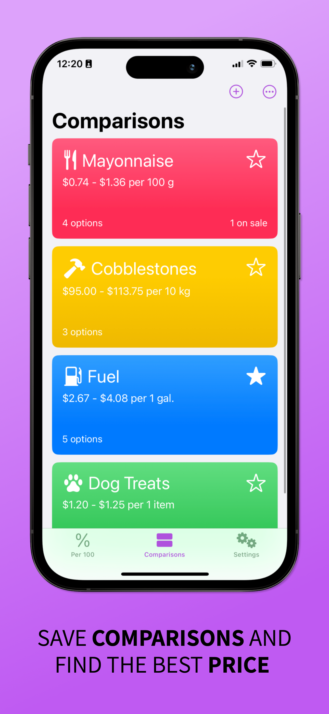
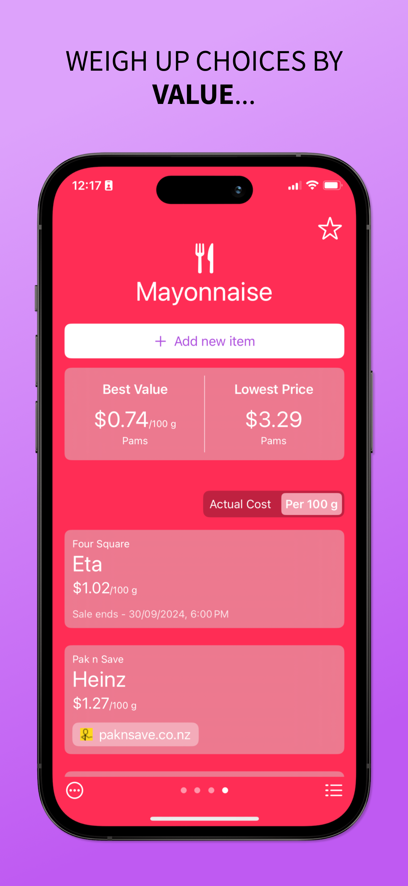
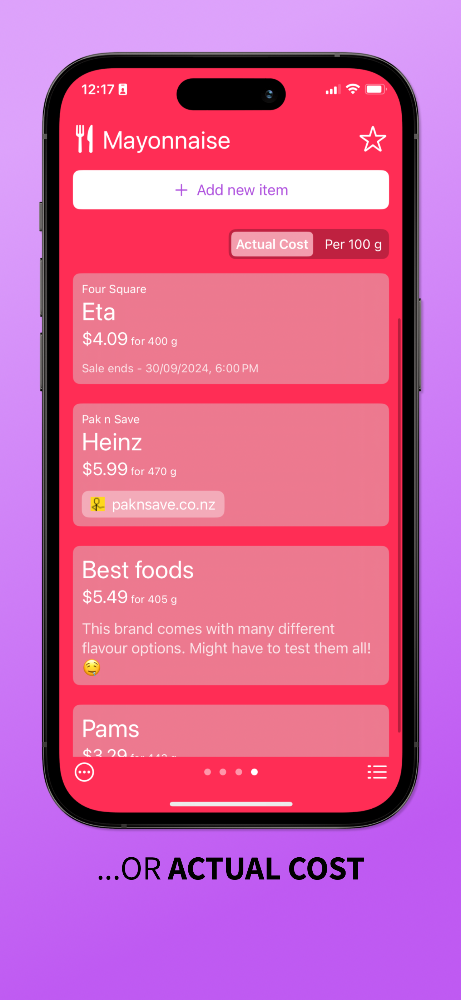
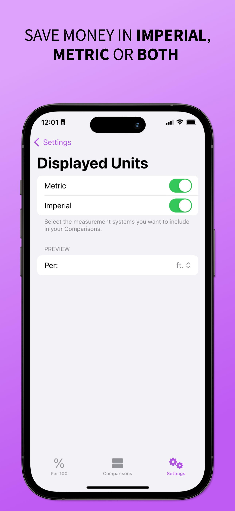

# 📱 Per 100

> *Built by [Chaotic Good Creations](https://www.chaoticgoodcreations.co) — digital experiences from Aotearoa 🇳🇿.*

---

### 🧭 Overview
Per 100 is a fast, no-fuss tool that helps you compare prices of anything — groceries, fuel, bulk buys — so you can spot the best deal instantly.  
It’s designed for simplicity and speed: open, type, decide, done.  
You can also **save a comparison** to keep tracking items and continue searching for the best value over time.

---

### 🖼️ Preview

  
  
  
  
  

---

### 🧩 Key Features
- ⚡ Quick price-per-100 g / mL / unit and more
- 🧮 Supports both metric and imperial units  
- 💾 **Save comparisons** to continue tracking and finding the best value  
- 🧠 Smart rounding for tidy, readable results  
- 🕶️ Minimal interface — no clutter, no ads  

---

### 🛠️ Tech Stack
| Category | Tools |
|-----------|--------|
| Language / Framework | Swift · SwiftUI |
| Platform | iOS 17 + |
| Design | Figma |
| Dev Tools | Xcode · GitHub |

---

### 📲 Download
🛒 Available on the [App Store →](https://apps.apple.com/app/per-100/id6670795904)

---

### 🧠 Development Notes
- Built entirely in SwiftUI for a smooth, modern interface.  
- Local storage ensures quick access and privacy without user accounts.  
- Reusable UI components allow consistent style across apps.  
- Optimised for one-hand use and accessibility.  

---

### 🪄 About Chaotic Good Creations
We design and develop custom apps and websites that balance creativity, usability, and fun.  
→ Visit [chaoticgoodcreations.co](https://www.chaoticgoodcreations.co) to see more.

> *Built beautifully, a little chaotically, and always for good.*

